## 基于Java+Springboot+vue的智能停车场管理系统(源代码+数据库+9000字论文)119

## 一、系统介绍
本项目前后端不分离

- 登录、控制台、停车场管理、车牌识别、车辆管理

- 角色管理、系统菜单、全局配置、停车记录、财务管理

- 控制台管理、系统日志、账号管理、用户管理、合作单位管理、密码修改、个人信息

### 论文截图
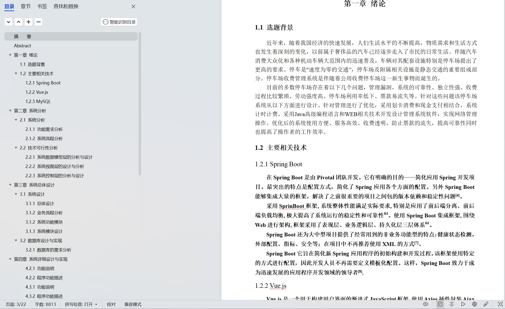

## 二、所用技术

后端技术栈：Springboot、jpa、Mysql、Maven、百度api

前端技术栈：Html、vue.js、BootStrap、Echarts、jQuery

## 三、环境介绍

基础环境 :IDEA/eclipse, JDK1.8, Mysql5.7及以上,Maven3.6

所有项目以及源代码本人均调试运行无问题 可支持远程调试运行

## 四、页面截图
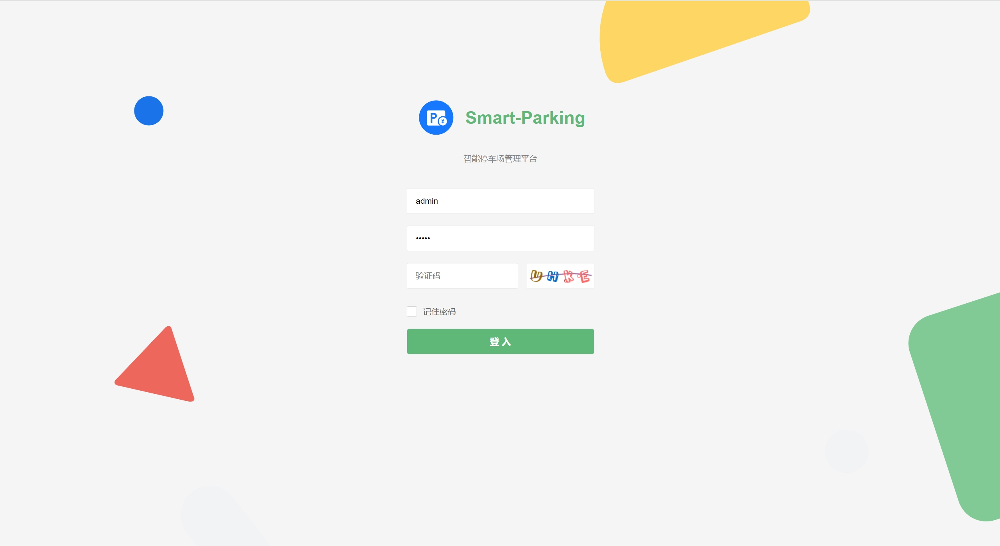
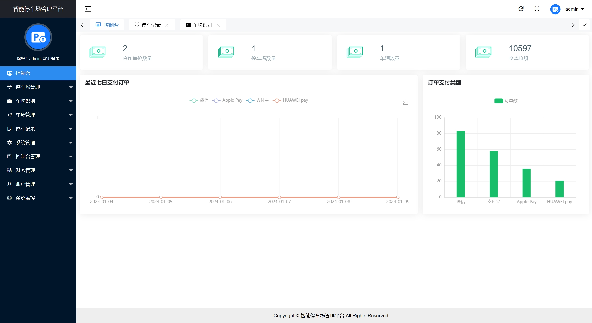
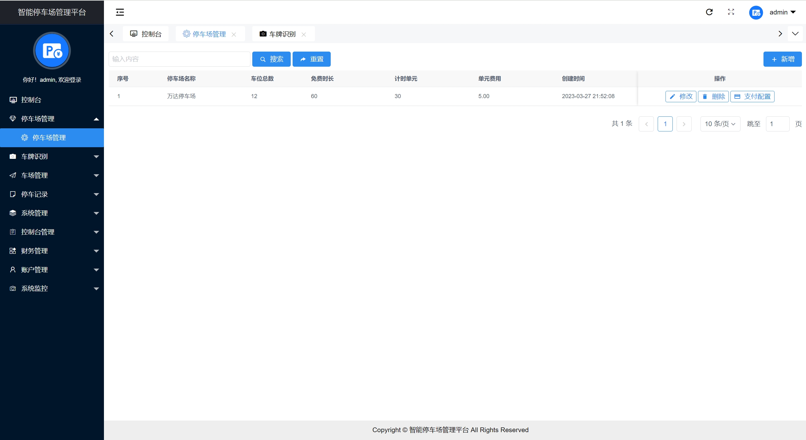
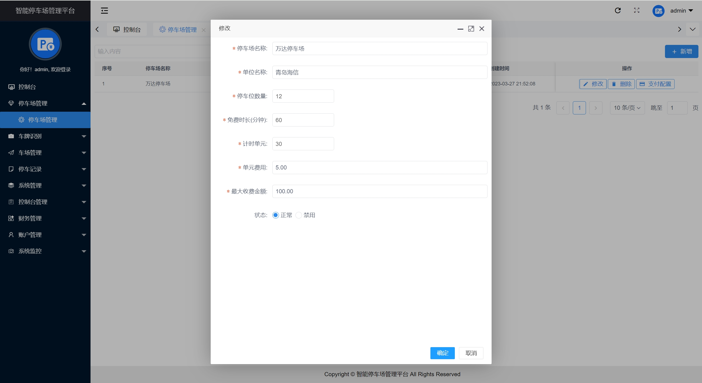
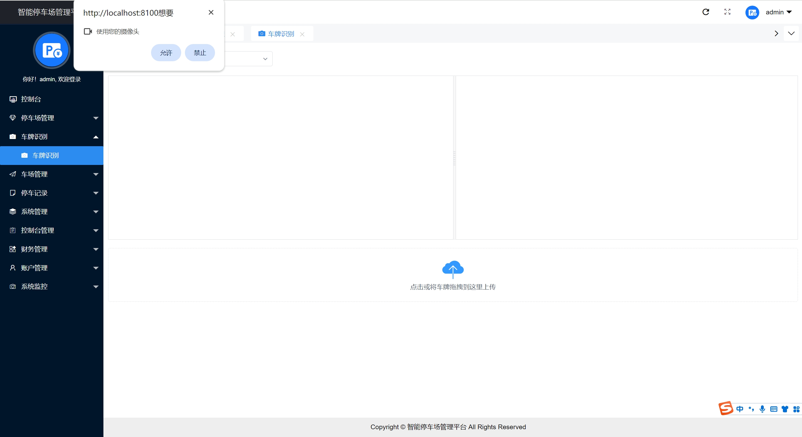
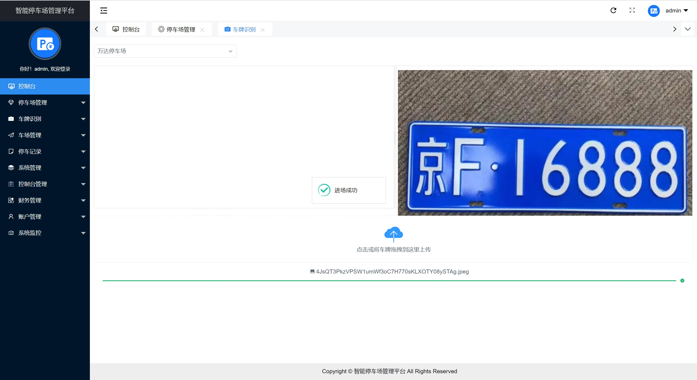
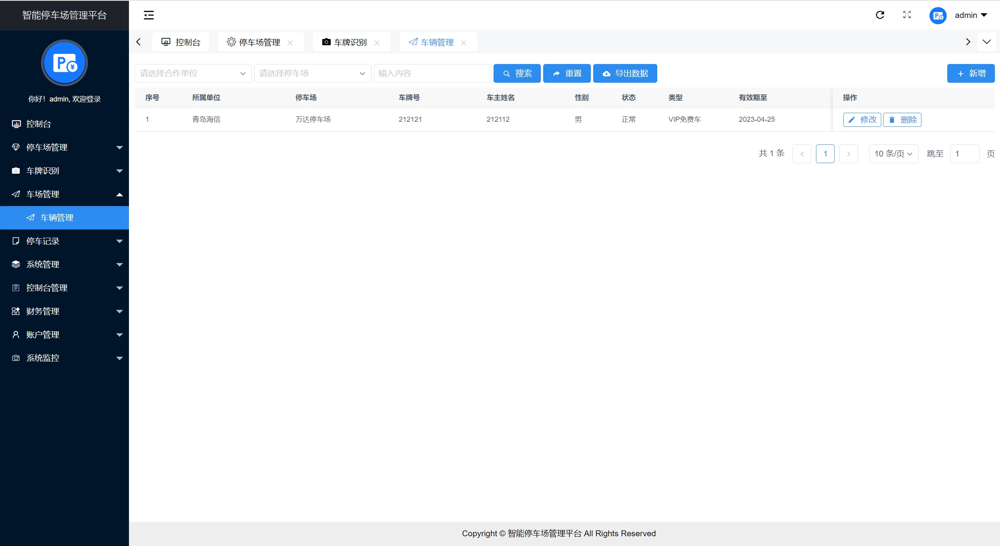
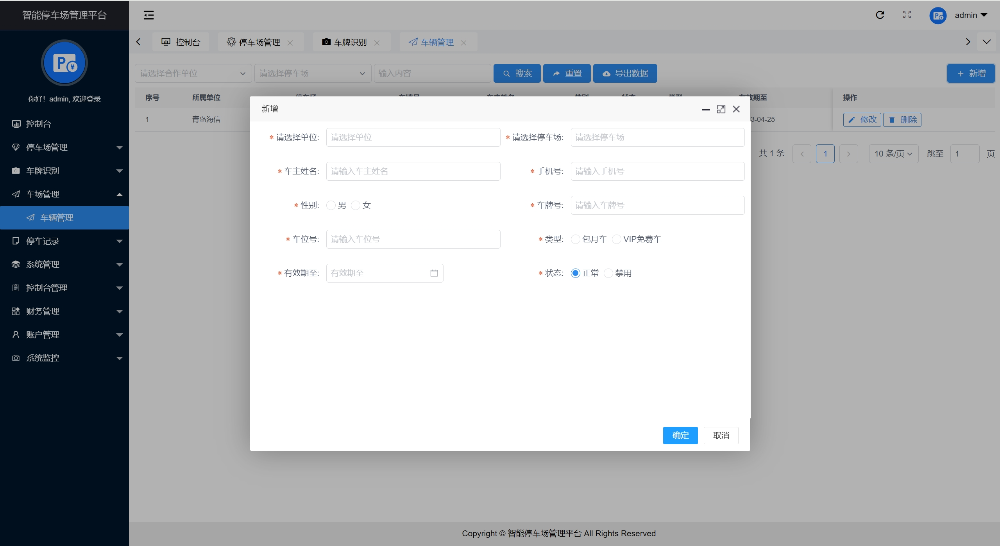

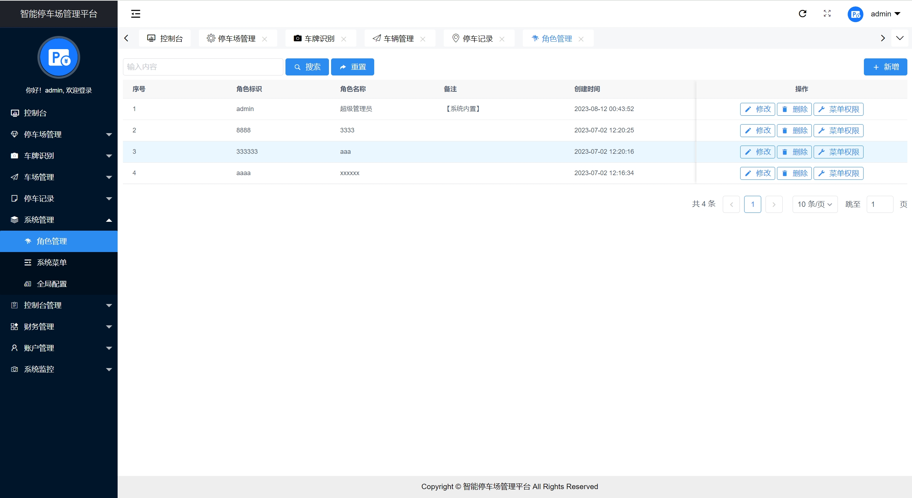
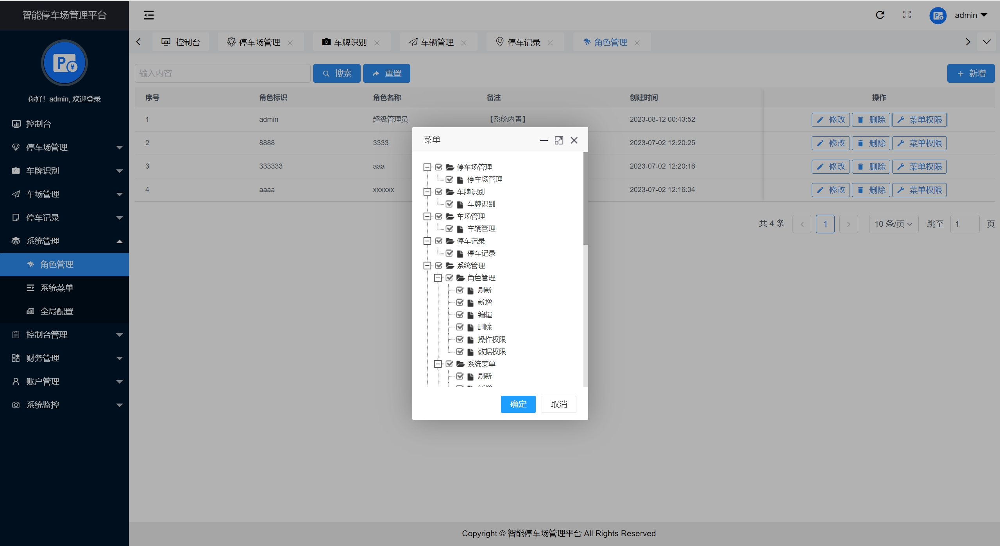
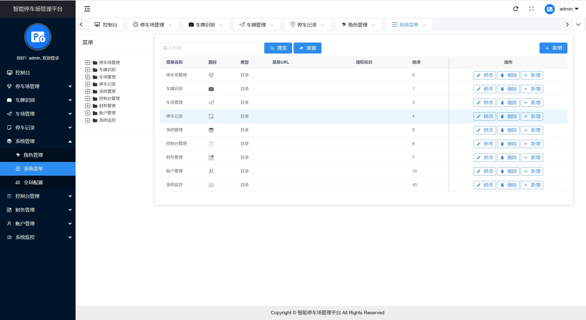
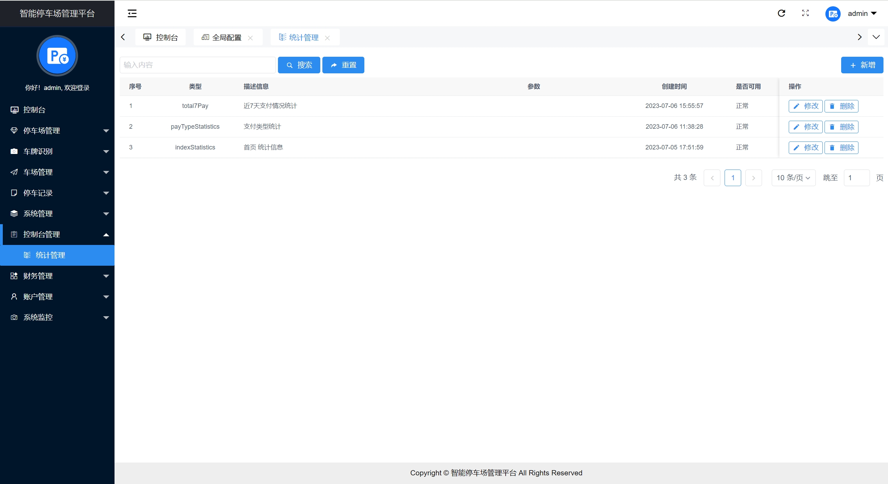
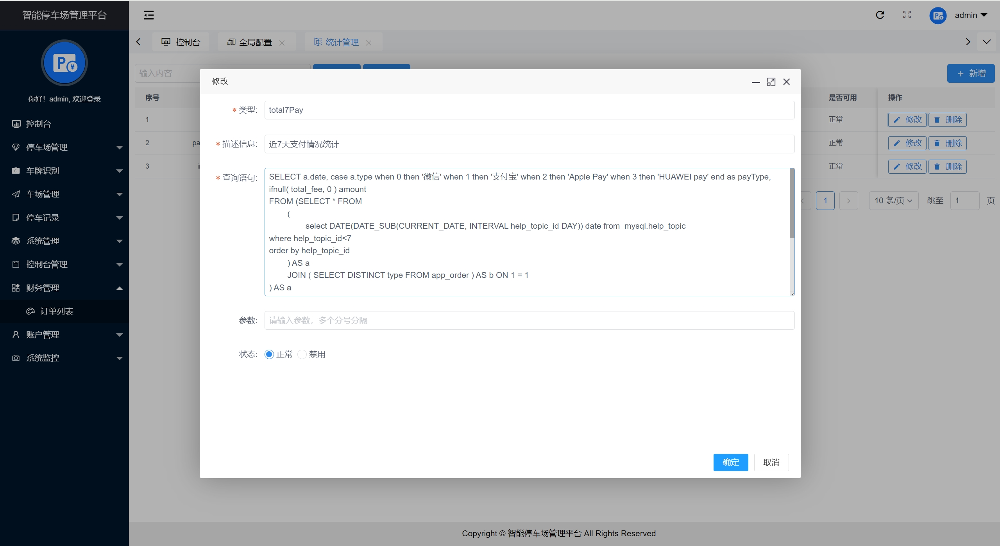
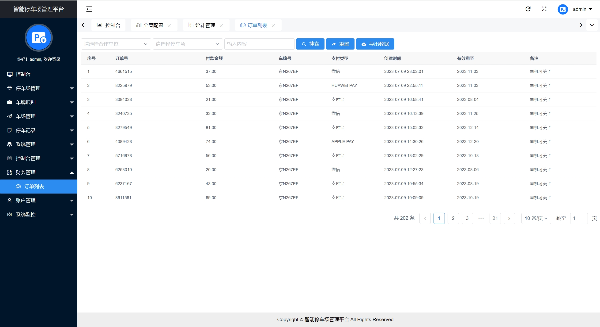
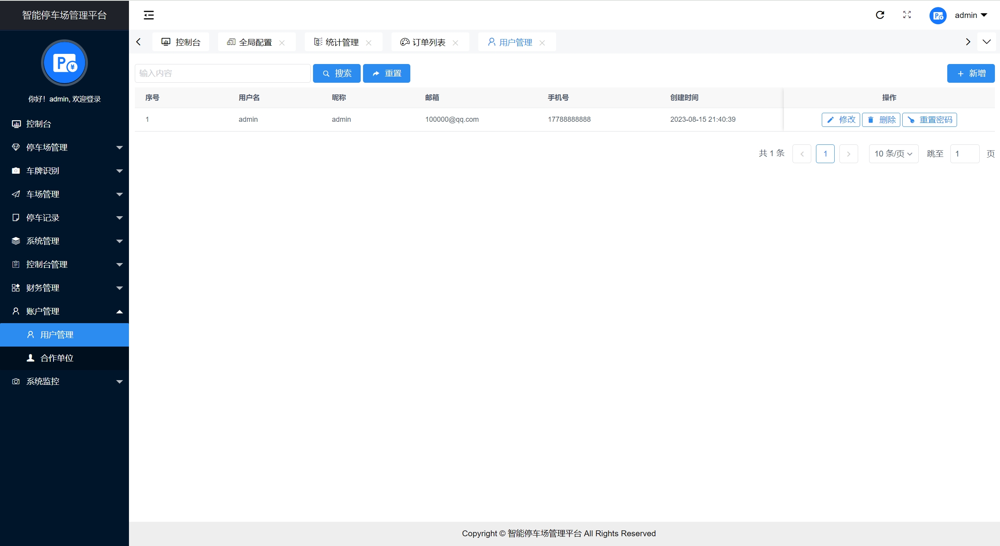
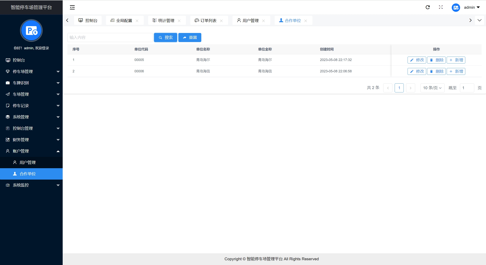
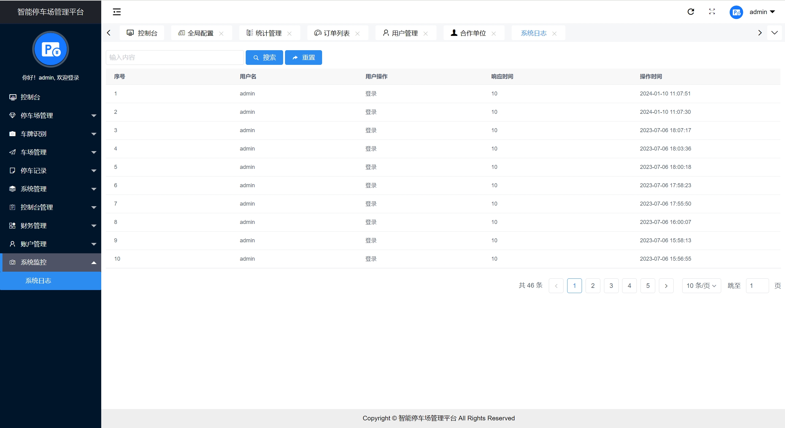
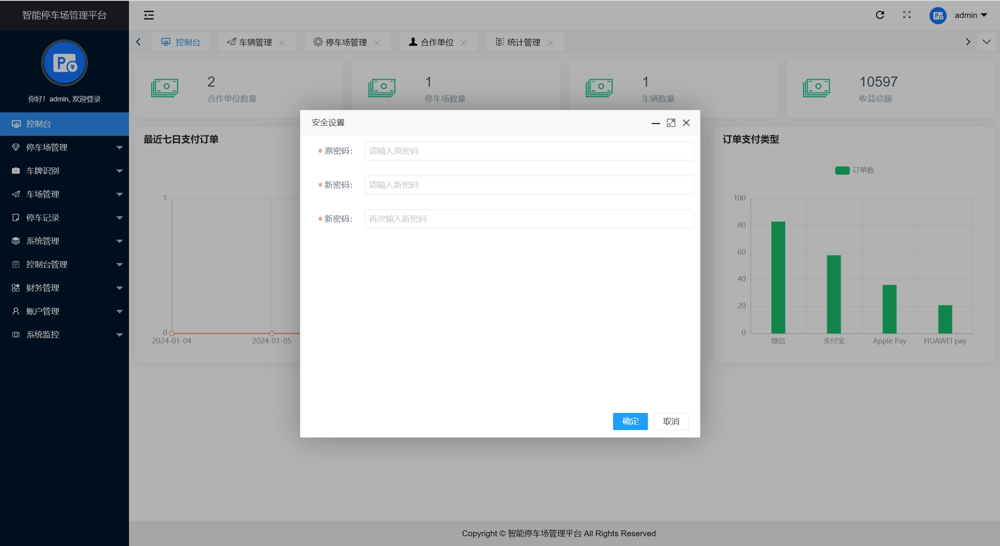

## 五、浏览地址

后端登录：http://localhost:8100

账户密码：admin/admin

## 六、部署教程
1. 使用Navicat或者其它工具，在mysql中创建对应名称的数据库，并执行项目的sql文件
2. 使用IDEA/Eclipse导入smart-parking项目，若为maven项目请选择maven，等待依赖下载完成
3. 修改application-dev.properties里面的数据库配置和百度api配置，启动后端项目

